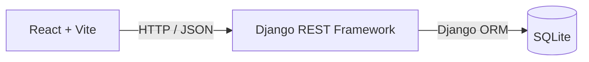
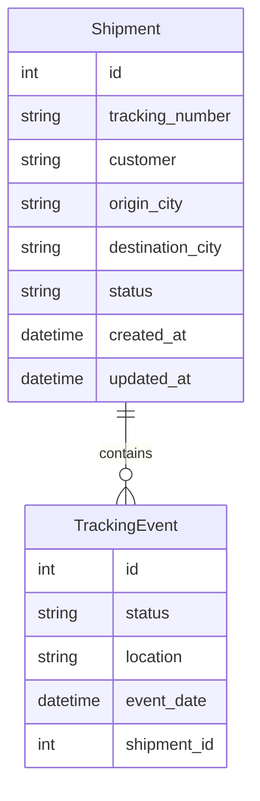
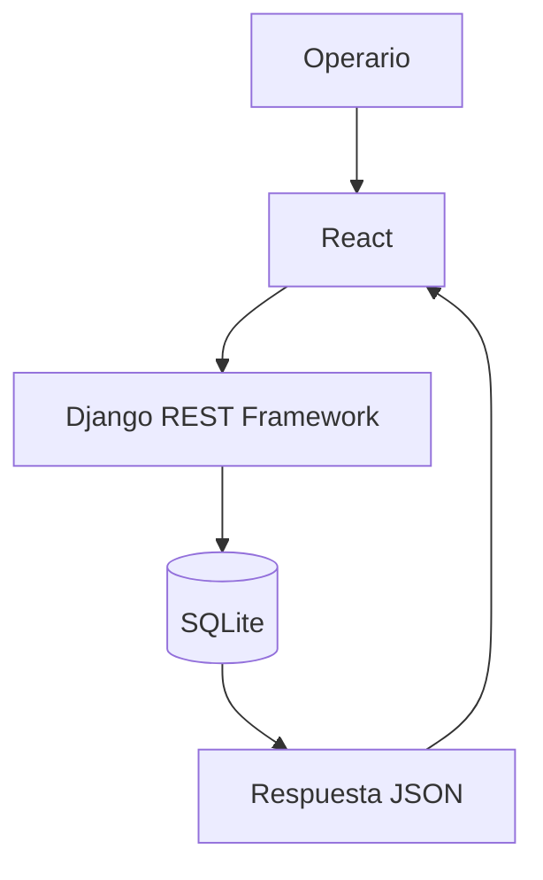
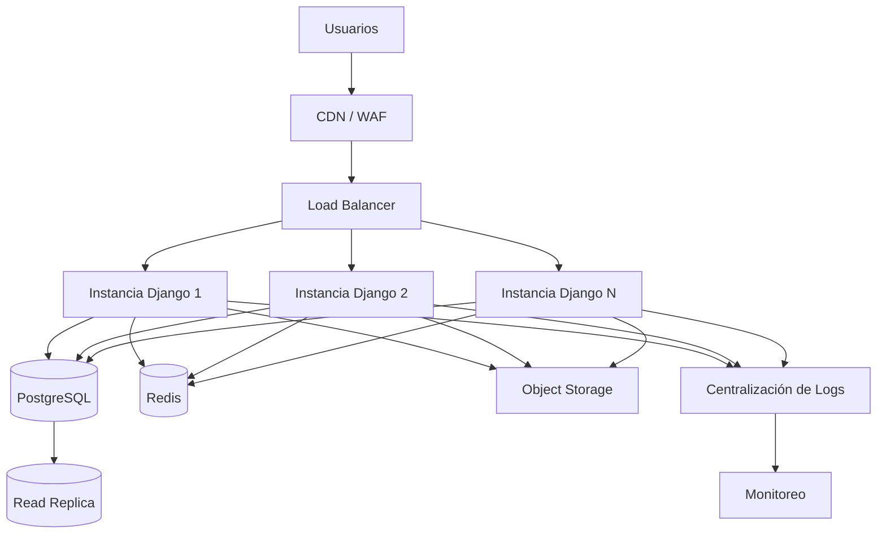

# Informe Técnico

**Proyecto:** Prueba Técnica – Expreso Andino  
**Documento:** `technical-report.md`  
**Versión:** 1.0  
**Autor:** Emilio Vargas  
**Fecha:** Julio de 2026

---

# Índice

- Introducción

# 1. Diseña una API REST para gestionar el ciclo de vida de envíos y entregas y consume el mismo desde un front en React a modo de interfaz para un operario de Andino.

- 1.1 Objetivo
- 1.2 Arquitectura implementada
- 1.3 Backend
- 1.4 Modelo de datos
- 1.5 Diseño de la API REST
- 1.6 Frontend
- 1.7 Consumo de la API

# 2. Describe cómo consumiste la API de seguimiento en React y Flutter y por qué lo hiciste así.

- 2.1 Consumo desde React
- 2.2 Propuesta para Flutter

# 3. Diseña la infraestructura para soportar 50.000 órdenes diarias con picos de tráfico.

- 3.1 Objetivos
- 3.2 Arquitectura propuesta
- 3.3 Componentes
- 3.4 Flujo de una solicitud
- 3.5 Estrategia de escalamiento

# Decisiones de diseño

# Conclusiones

---

# Introducción

El presente documento describe la solución desarrollada para la prueba técnica de **Expreso Andino**, cuyo objetivo consiste en diseñar una API REST para la gestión del ciclo de vida de los envíos y desarrollar una interfaz web que permita consultar dicha información desde un cliente React.

La implementación fue realizada utilizando **Python**, **Django**, **Django REST Framework**, **Django ORM** y **SQLite** para el backend, mientras que el frontend fue desarrollado con **React**, **Vite**, **JavaScript**, **Axios** y **CSS**.

La solución implementa las funcionalidades solicitadas para la administración de envíos y la consulta de su historial de seguimiento mediante una arquitectura cliente-servidor desacoplada, donde el frontend consume la API REST expuesta por el backend.

Es importante aclarar que este documento diferencia claramente entre dos aspectos:

- **La solución efectivamente implementada para la prueba técnica**, descrita en las primeras secciones.
- **Una propuesta de arquitectura para un entorno productivo**, presentada posteriormente como un ejercicio de diseño para soportar un mayor volumen de transacciones.

En consecuencia, cualquier componente o tecnología mencionada dentro de la propuesta de infraestructura debe entenderse únicamente como una recomendación de evolución de la arquitectura y no como parte de la implementación desarrollada para esta prueba.

---

# 1. Diseña una API REST para gestionar el ciclo de vida de envíos y entregas y consume el mismo desde un front en React a modo de interfaz para un operario de Andino.

## 1.1 Objetivo

El objetivo de la solución consiste en proporcionar una plataforma sencilla para la administración y consulta de envíos, permitiendo que un operario pueda visualizar la información principal de cada envío y consultar su historial de seguimiento desde una interfaz web.

La arquitectura fue diseñada buscando mantener una clara separación entre la capa de presentación y la lógica de negocio, permitiendo que cualquier cliente HTTP pueda consumir la API sin depender de una implementación específica del frontend.

Como resultado, el sistema queda dividido en dos aplicaciones independientes:

- Backend desarrollado con Django y Django REST Framework.
- Frontend desarrollado con React y Vite.

Esta separación facilita el mantenimiento, la evolución de cada componente y la incorporación futura de nuevos consumidores de la API.

---

## 1.2 Arquitectura implementada

La solución implementa una arquitectura cliente-servidor tradicional donde el frontend consume la API REST mediante solicitudes HTTP y el backend gestiona la persistencia de la información utilizando Django ORM sobre una base de datos SQLite.

La Figura 1 muestra la arquitectura general implementada.

### Figura 1. Arquitectura implementada



El flujo de procesamiento de una solicitud es el siguiente:

1. El operario interactúa con la interfaz desarrollada en React.
2. React realiza una solicitud HTTP utilizando Axios.
3. Django REST Framework procesa la petición.
4. Django ORM consulta la base de datos SQLite.
5. La información es serializada como JSON.
6. React actualiza la interfaz con los datos obtenidos.

La arquitectura implementada mantiene un bajo nivel de acoplamiento entre el cliente y el servidor, permitiendo modificar cualquiera de los dos componentes sin afectar significativamente al otro, siempre que el contrato de la API permanezca estable.

---

## 1.3 Backend

El backend fue desarrollado utilizando **Python**, **Django** y **Django REST Framework**, aprovechando las capacidades del framework para la construcción rápida de APIs REST y el manejo del acceso a datos mediante Django ORM.

La organización del proyecto sigue la estructura recomendada por Django, separando las responsabilidades entre modelos, vistas, serializadores y configuración de la aplicación.

De forma general, el backend se compone de los siguientes elementos:

| Componente | Responsabilidad |
|------------|-----------------|
| Models | Representación de las entidades persistentes. |
| Serializers | Conversión entre objetos del dominio y representaciones JSON. |
| Views | Implementación de los endpoints REST. |
| URL Configuration | Definición de las rutas expuestas por la API. |
| Django ORM | Acceso a la base de datos. |

El uso de Django REST Framework permitió reducir considerablemente la cantidad de código repetitivo, facilitando la construcción de una API consistente y fácil de mantener.

Para esta prueba técnica no se implementaron mecanismos de autenticación ni autorización, ya que dichos requerimientos no hacían parte del alcance solicitado.

Asimismo, la persistencia se realizó utilizando SQLite por tratarse de una base de datos ligera y suficiente para un entorno de evaluación técnica.

---

## 1.4 Modelo de datos

El dominio de la aplicación se modeló mediante dos entidades principales:

- **Shipment**
- **TrackingEvent**

Cada envío mantiene un historial compuesto por múltiples eventos de seguimiento, estableciendo una relación de uno a muchos entre ambas entidades.

La Figura 2 presenta el modelo entidad-relación implementado.

### Figura 2. Modelo Entidad–Relación



### Entidad Shipment

Esta entidad representa un envío dentro del sistema.

Los principales atributos almacenados son:

| Campo | Descripción |
|--------|-------------|
| tracking_number | Número único de guía. |
| customer | Cliente asociado al envío. |
| origin_city | Ciudad de origen. |
| destination_city | Ciudad de destino. |
| status | Estado actual del envío. |
| created_at | Fecha de creación del registro. |
| updated_at | Fecha de última actualización. |

---

### Entidad TrackingEvent

Representa cada cambio de estado ocurrido durante el ciclo de vida del envío.

Cada evento pertenece a un único envío y registra la evolución histórica del proceso logístico.

Los principales atributos son:

| Campo | Descripción |
|--------|-------------|
| status | Estado registrado durante el evento. |
| location | Ubicación donde ocurrió el evento. |
| event_date | Fecha y hora del evento. |

La separación entre ambas entidades evita la duplicación de información y permite mantener un historial completo de seguimiento sin modificar los datos principales del envío.

---

## 1.5 Diseño de la API REST

La comunicación entre el frontend y el backend se realiza mediante una API REST desarrollada con Django REST Framework.

La API expone recursos claramente definidos, utilizando respuestas en formato JSON y los verbos HTTP apropiados para la consulta de información.

Los endpoints implementados son los siguientes:

| Método | Endpoint | Descripción |
|---------|----------|-------------|
| GET | `/api/shipments/` | Obtiene el listado de envíos. |
| GET | `/api/shipments/{id}/` | Obtiene el detalle de un envío específico. |
| GET | `/api/shipments/{id}/tracking/` | Obtiene el historial de seguimiento asociado al envío. |

La estructura de la API fue diseñada para que cada recurso represente una entidad del dominio, facilitando su comprensión y consumo desde aplicaciones cliente.

Al no existir autenticación dentro del alcance de la prueba técnica, los endpoints permanecen accesibles sin mecanismos adicionales de autorización.

---

**Fin de la Entrega 1.**

La **Entrega 2** continuará con:

- **1.6 Frontend**
- **1.7 Consumo de la API**
- **Sección 2 completa (React y propuesta para Flutter)**, manteniendo el mismo estilo y continuidad del documento.

## 1.6 Frontend

La interfaz de usuario fue desarrollada utilizando **React** y **Vite**, con el objetivo de proporcionar una experiencia ágil para el operario encargado de consultar la información de los envíos.

La aplicación se diseñó como un cliente desacoplado del backend, consumiendo la información exclusivamente a través de la API REST. Esta decisión permite que tanto el frontend como el backend evolucionen de manera independiente mientras se mantenga el contrato definido por los endpoints.

La comunicación entre ambas aplicaciones se realiza mediante **Axios**, utilizando solicitudes HTTP y respuestas en formato JSON.

La interfaz implementa las siguientes funcionalidades principales:

| Funcionalidad | Descripción |
|--------------|-------------|
| Dashboard | Punto de entrada de la aplicación. |
| Tabla de envíos | Visualización del listado de envíos disponibles. |
| Búsqueda | Consulta de envíos mediante el número de guía. |
| Filtro por estado | Filtrado de registros según el estado del envío. |
| Vista de detalle | Información completa de un envío seleccionado. |
| Historial de seguimiento | Consulta cronológica de los eventos asociados al envío. |

Desde el punto de vista de la experiencia de usuario, se buscó mantener una navegación sencilla, priorizando la rapidez para localizar información relevante sin realizar recargas completas de la página.

Asimismo, la responsabilidad de la interfaz se limita a la presentación de los datos obtenidos desde la API, evitando incorporar lógica de negocio que deba mantenerse en el servidor.

---

## 1.7 Consumo de la API

El consumo de la API se implementó utilizando **Axios**, una biblioteca ampliamente utilizada para realizar solicitudes HTTP desde aplicaciones React.

Se optó por centralizar las llamadas al backend mediante una capa de servicios, evitando que los componentes de la interfaz realizaran directamente las peticiones HTTP. Esta organización mejora la mantenibilidad del proyecto y facilita futuras modificaciones, como cambios en la URL base de la API o la incorporación de nuevos endpoints.

De forma general, el flujo de comunicación entre la interfaz y el backend es el siguiente:

1. El usuario realiza una acción desde la interfaz.
2. El componente React invoca el servicio correspondiente.
3. Axios envía la solicitud HTTP al backend.
4. Django REST Framework procesa la petición.
5. La información es recuperada mediante Django ORM.
6. El backend responde con un objeto JSON.
7. React actualiza el estado de la aplicación y renderiza la información.

La Figura 3 ilustra este proceso.

### Figura 3. Flujo de una consulta



Este flujo mantiene claramente separadas las responsabilidades entre la capa de presentación y la capa de negocio, permitiendo que el frontend permanezca independiente de los detalles internos del servidor.

---

# 2. Describe cómo consumiste la API de seguimiento en React y Flutter y por qué lo hiciste así.

## 2.1 Consumo desde React

La aplicación React consume la API REST mediante solicitudes HTTP realizadas con Axios.

Cada vista obtiene únicamente la información necesaria para su funcionamiento, reduciendo la cantidad de datos transferidos entre cliente y servidor y simplificando la actualización del estado de la interfaz.

El flujo de trabajo implementado puede resumirse de la siguiente manera:

- El usuario accede al listado de envíos.
- React solicita la información al endpoint correspondiente.
- El backend responde con los datos serializados en formato JSON.
- La interfaz renderiza la información recibida.
- Cuando el usuario selecciona un envío, se realiza una nueva consulta para obtener el detalle y el historial de seguimiento.

Este enfoque presenta varias ventajas:

- Bajo acoplamiento entre frontend y backend.
- Reutilización de la misma API por diferentes clientes.
- Mayor facilidad para realizar mantenimiento.
- Posibilidad de evolucionar la interfaz sin modificar la lógica del servidor.

Al delegar toda la lógica de negocio al backend, React permanece enfocado exclusivamente en la representación de la información y la interacción con el usuario.

---

## 2.2 Propuesta para Flutter

Dentro del alcance de la prueba técnica **no se desarrolló una aplicación Flutter**.

Sin embargo, la arquitectura implementada permite incorporar un cliente móvil sin necesidad de realizar modificaciones significativas en el backend.

Debido a que toda la funcionalidad se expone mediante una API REST independiente de la interfaz, cualquier aplicación capaz de realizar solicitudes HTTP puede consumir los mismos recursos utilizados por React.

En este escenario, una futura aplicación Flutter podría reutilizar directamente los siguientes endpoints:

| Endpoint | Uso en Flutter |
|----------|----------------|
| `/api/shipments/` | Consulta del listado de envíos. |
| `/api/shipments/{id}/` | Visualización del detalle del envío. |
| `/api/shipments/{id}/tracking/` | Consulta del historial de seguimiento. |

Esta aproximación presenta varias ventajas:

- Reutilización completa de la lógica del servidor.
- Un único origen de datos para múltiples clientes.
- Menor esfuerzo de mantenimiento.
- Consistencia entre las aplicaciones web y móvil.

Es importante destacar que esta sección constituye únicamente una **propuesta de integración**. No forma parte de la implementación desarrollada para la prueba técnica y no debe interpretarse como la existencia de una aplicación Flutter funcional.

La decisión de mantener una API REST desacoplada facilita precisamente este tipo de extensiones futuras, permitiendo incorporar nuevos consumidores sin alterar la lógica existente.

---

**Fin de la Entrega 2.**

La **Entrega 3** desarrollará la propuesta de infraestructura para soportar aproximadamente **50.000 órdenes diarias**, incluyendo la arquitectura recomendada para producción, los diagramas Mermaid correspondientes, las decisiones de diseño y las conclusiones finales del informe.

# 3. Diseña la infraestructura para soportar 50.000 órdenes diarias con picos de tráfico.

> **Importante**
>
> La infraestructura descrita en esta sección **no corresponde a la implementación desarrollada para la prueba técnica**.
>
> La aplicación entregada utiliza **SQLite** como base de datos y una única instancia del backend, lo cual resulta suficiente para el alcance de la evaluación.
>
> El diseño presentado a continuación constituye una **propuesta de arquitectura para un entorno de producción**, orientada a mejorar la disponibilidad, escalabilidad y mantenibilidad del sistema ante un crecimiento significativo de la carga de trabajo.

---

## 3.1 Objetivos

Para un escenario con aproximadamente **50.000 órdenes diarias**, la infraestructura debe cumplir varios objetivos técnicos además de ofrecer disponibilidad continua del servicio.

Los principales objetivos de la arquitectura propuesta son:

- Alta disponibilidad.
- Escalabilidad horizontal.
- Tolerancia a fallos.
- Baja latencia para consultas frecuentes.
- Facilidad de monitoreo.
- Recuperación ante desastres.
- Capacidad de crecimiento gradual conforme aumente la demanda.

A diferencia del entorno utilizado para la prueba técnica, un escenario de producción requiere desacoplar varios componentes para evitar puntos únicos de falla y distribuir adecuadamente la carga de trabajo.

---

## 3.2 Arquitectura propuesta

La Figura 4 presenta una propuesta de arquitectura orientada a producción, manteniendo la misma aplicación desarrollada durante la prueba técnica pero incorporando componentes adicionales para soportar un mayor volumen de usuarios y solicitudes.

### Figura 4. Arquitectura propuesta para producción



Esta arquitectura mantiene el mismo principio utilizado en la implementación original: una API REST desacoplada del cliente. La diferencia consiste en distribuir las responsabilidades entre varios componentes especializados para mejorar el rendimiento y la disponibilidad del sistema.

---

## 3.3 Componentes

La siguiente tabla resume la función de cada componente dentro de la arquitectura propuesta.

| Componente | Responsabilidad |
|------------|-----------------|
| CDN / WAF | Protección frente a ataques comunes y distribución eficiente del contenido estático. |
| Load Balancer | Distribución de solicitudes entre múltiples instancias del backend. |
| Instancias de Django | Procesamiento de la lógica de negocio y atención de solicitudes HTTP. |
| PostgreSQL | Base de datos principal para operaciones de lectura y escritura. |
| Read Replica | Réplica destinada a consultas de solo lectura para reducir la carga sobre la base principal. |
| Redis | Caché para consultas frecuentes y reducción de la latencia. |
| Object Storage | Almacenamiento de archivos y recursos estáticos. |
| Centralización de logs | Recolección de registros para facilitar auditoría y diagnóstico. |
| Monitoreo | Supervisión del estado de la infraestructura y generación de alertas. |

La incorporación de estos componentes permite aumentar progresivamente la capacidad del sistema sin modificar la lógica de negocio implementada en la aplicación.

---

## 3.4 Flujo de una solicitud

En un entorno de producción, una solicitud seguiría un flujo similar al mostrado en la Figura 4, aunque incorporando mecanismos adicionales para distribuir la carga y optimizar el acceso a los recursos.

El flujo general sería el siguiente:

1. El usuario accede a la aplicación web.
2. La solicitud atraviesa el CDN y el WAF.
3. El balanceador selecciona una instancia disponible de Django.
4. La aplicación procesa la solicitud.
5. Si la información se encuentra en caché, la respuesta se obtiene desde Redis.
6. En caso contrario, la aplicación consulta PostgreSQL.
7. La información es serializada como JSON y enviada al cliente.

Este enfoque reduce los tiempos de respuesta para consultas frecuentes y distribuye la carga entre múltiples instancias del backend.

---

## 3.5 Estrategia de escalamiento

Una ventaja de la solución implementada es que permite evolucionar de forma gradual, evitando introducir complejidad innecesaria en las primeras etapas del proyecto.

La Figura 5 muestra una posible estrategia de crecimiento conforme aumente el volumen de usuarios y operaciones.

### Figura 5. Estrategia de escalamiento

```mermaid
flowchart TD

A[MVP]

B[PostgreSQL]

C[Load Balancer]

D[Redis]

E[Servicios especializados<br/>(solo si el negocio lo requiere)]

A --> B
B --> C
C --> D
D --> E
```

La evolución propuesta puede resumirse en las siguientes etapas:

### Etapa 1 — MVP

La arquitectura utilizada durante la prueba técnica es suficiente para validar la funcionalidad del sistema y facilitar el desarrollo inicial.

### Etapa 2 — Base de datos de producción

A medida que aumente el volumen de información, SQLite puede reemplazarse por PostgreSQL para ofrecer mayor robustez, concurrencia y capacidad de crecimiento.

### Etapa 3 — Balanceo de carga

Cuando una única instancia del backend deje de ser suficiente, es posible desplegar múltiples instancias de Django detrás de un balanceador de carga.

### Etapa 4 — Caché

La incorporación de Redis permite reducir el número de consultas repetitivas a la base de datos, mejorando el rendimiento de las operaciones de lectura.

### Etapa 5 — Servicios especializados

Solo si las necesidades del negocio lo justifican, podrían separarse determinados procesos en servicios independientes. Esta decisión debe tomarse cuando exista evidencia de que la arquitectura existente representa una limitación real y no como una optimización prematura.

---

# Decisiones de diseño

Durante el desarrollo de la prueba técnica se tomaron diversas decisiones con el objetivo de mantener una solución sencilla, mantenible y alineada con el alcance solicitado.

## Separación entre frontend y backend

Se optó por desarrollar el frontend y el backend como aplicaciones independientes que se comunican exclusivamente mediante una API REST.

Esta decisión favorece el desacoplamiento entre ambas capas y permite evolucionarlas de manera independiente.

---

## Uso de Django REST Framework

Django REST Framework proporciona una estructura sólida para construir APIs REST, incluyendo serialización, manejo de solicitudes HTTP y herramientas para la exposición de recursos de forma consistente.

Su utilización permitió reducir código repetitivo y concentrar el desarrollo en la lógica del dominio.

---

## Uso de Django ORM

La persistencia se implementó mediante Django ORM, evitando la escritura manual de consultas SQL y facilitando el mantenimiento del modelo de datos.

Además, este enfoque mejora la legibilidad del código y simplifica futuras modificaciones en la estructura de la base de datos.

---

## Uso de SQLite

SQLite fue seleccionada exclusivamente por tratarse de una prueba técnica.

Su facilidad de configuración permitió disponer rápidamente de un entorno funcional sin depender de infraestructura adicional.

Como se explicó en la **Sección 3**, una implementación orientada a producción debería utilizar un motor de base de datos como PostgreSQL.

---

## API REST desacoplada

La lógica de negocio se concentra completamente en el backend, mientras que el frontend actúa únicamente como consumidor de la API.

Esta decisión facilita la incorporación de nuevos clientes, como aplicaciones móviles o integraciones con otros sistemas, reutilizando los mismos endpoints.

---

## Arquitectura preparada para evolucionar

Aunque la implementación actual responde al alcance de la prueba técnica, la separación de responsabilidades permite incorporar nuevos componentes de infraestructura sin modificar la lógica principal del sistema.

Esto facilita la evolución gradual de la solución conforme aumenten las necesidades del negocio.

---

# Conclusiones

La solución desarrollada cumple con el objetivo de proporcionar una API REST para la gestión de envíos y su seguimiento, junto con una interfaz web desarrollada en React para facilitar la consulta de la información por parte de un operario.

La implementación mantiene una arquitectura sencilla y desacoplada, donde el frontend consume los recursos expuestos por Django REST Framework mediante solicitudes HTTP, favoreciendo la mantenibilidad y la reutilización de la lógica de negocio.

Aunque el entorno de la prueba utiliza SQLite como mecanismo de persistencia, la arquitectura propuesta demuestra que el sistema puede evolucionar hacia un escenario de producción incorporando componentes adicionales como PostgreSQL, balanceadores de carga, mecanismos de caché y herramientas de monitoreo, sin alterar el diseño fundamental de la aplicación.

En conjunto, la solución busca equilibrar simplicidad, claridad y capacidad de crecimiento, implementando únicamente las tecnologías requeridas para la prueba técnica y proponiendo una ruta de evolución coherente para escenarios de mayor demanda.